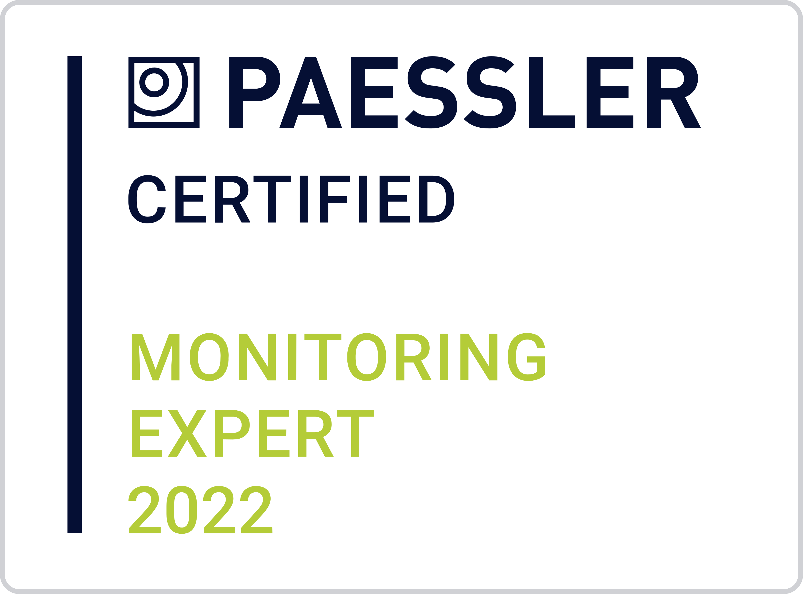

¡HOLA! 

Soy Xavi, trabajo como SysOps en Encora, una consultoría especializada en servicios de IT. 

Actualmente, desempeño mis funciones en el departamente de Infraestrucutra, dando soporte a los clientes en temas de virtualización, almacenamiento, backup y gestión del CPD.

Tengo la suerte de dedicarme a la tecnología, que realmente me apasiona y también me gusta mucho la ciencia y la nautraleza.

Dispongo de dos certificaciones oficiales:

- AZ-900: Microsoft Certified: Azure Fundamentals 

- Paessler Certified Monitoring Expert 2022

